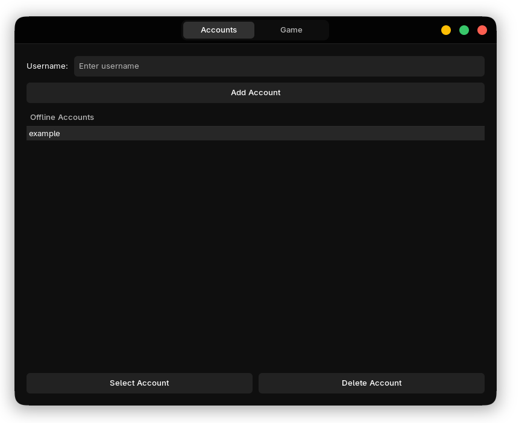
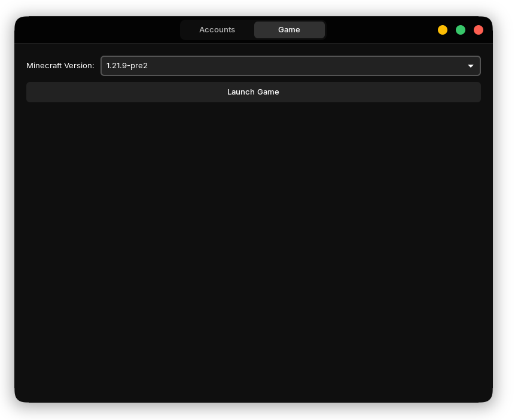

# 💻 Hackerman Launcher

<image src="https://github.com/user-attachments/assets/824e86fa-343e-4a22-941f-0458cf4cb03e" width=164px id="img"/>

_The minimalist, open-source Minecraft launcher for Linux and tinkerers._

---

Welcome! Hackerman Launcher is a lightweight, no-nonsense Minecraft launcher designed for Linux users who want a simple, offline-friendly alternative to the big-name launchers. If you want to manage accounts and versions without bloat, you’re in the right place.

---

## ✨ Why Hackerman Launcher?

- **Offline account support:** No Microsoft account? No problem.
- **Choose your version:** Instantly grab any official Minecraft version thanks to Mojang’s manifest.
- **Simple config:** Your accounts, versions, and settings are saved automatically.
- **Open source:** Tweak it, fork it, break it—your call!

---

## 📸 Screenshots

### Account Management

*Add and manage offline Minecraft accounts with a clean, simple interface.*

### Game Launching

*Select your desired Minecraft version and launch the game instantly.*

---

## 🚀 Quickstart

> _Note: This launcher is for Linux. It might work elsewhere!_

### 1. System dependencies

You’ll need Python 3, pip, and GTK+ 3 development files. Here’s how to get them:

**Debian/Ubuntu:**
```bash
sudo apt update
sudo apt install -y python3 python3-pip python3-gi gir1.2-gtk-3.0
```

**Arch/Manjaro:**
```bash
sudo pacman -Syu
sudo pacman -S python python-pip python-gobject gtk-3
```

### 2. Set up your Python virtual environment

```bash
python -m venv .venv
. .venv/bin/activate
```

### 3. Install Python dependencies

```bash
pip install minecraft-launcher-lib
```

### 4. Launch Hackerman!

```bash
python launcher.py
```

---

## 🗂️ Where’s my stuff?

Hackerman Launcher stores all its data (accounts, downloads, configs, etc.) in:

```
~/.hackerman-launcher/
```

Hackerman Launcher's config in:
```
~/.config/hackerman-launcher
```

---

## 🤝 Contributing

PRs, bug reports, and ideas are all welcome! Want to add features? Find a bug? Just want to say hi?  
Open an issue or PR and let’s make Minecraft on Linux awesome together.

---

## 🙋 FAQ

**Q: Is this safe for my Mojang/Microsoft account?**  
A: This launcher currently only supports offline accounts. No credentials are sent anywhere.

**Q: Can I use mods?**  
A: Not yet—but it’s on the roadmap!

**Q: Will you support Windows/macOS?**  
A: Maybe. Try it and let us know what breaks.

---

## 📜 License

MIT. Use Minecraft that way as you want.

---

## 🦸‍♂️ Credits

Made by [wcupped](https://github.com/wcupped) and the open-source community.

---

> _“You’re a real Minecraft player now.”_